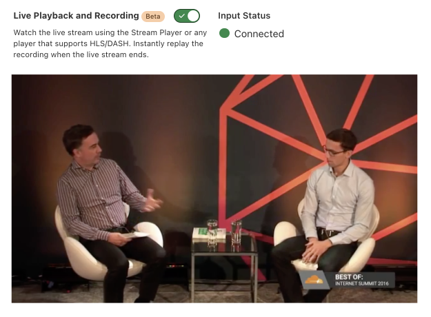

# Start a live stream

You can start a live stream using the Stream Dashboard or the API. After you subscribe to Stream, you can create Live Inputs and begin sending your live video to Cloudflare Stream using RTMPS.

## Use the Dashboard

1. Log in to your Cloudflare account.
1. From **Menu**, under **Products** click **Stream**.
1. Click the **Live Inputs** tab.
1. Click the **Create Live Input** button.
1. Under **Name**, enter a name for your Live Input.
1. Click **Create Live Input** when you are done.

After you create a Live Input, you can retrieve the RTMPS URL and Key.

  

A few seconds after pushing your live stream to Cloudflare Stream, the live video stream appears.



## Use the API

To start a live stream programmatically, make a `POST` request to the `/live_inputs` endpoint.

```bash
curl -X POST \ -H "Authorization: Bearer $TOKEN" \https://api.cloudflare.com/client/v4/accounts/$ACCOUNT/stream/live_inputs \--data '{"meta": {"name":"test stream 1"},"recording": { "mode": "automatic", "timeoutSeconds": 10, "requireSignedURLs": false, "allowedOrigins": ["*.example.com"] }}'
```

Refer to the API documentation for [Create a live input endpoint](https://api.cloudflare.com/#stream-live-inputs-create-a-live-input) and review the `recording` parameter's properties for acceptable values.

A successful response will return information about the live input.

```json
{
  "uid": "f256e6ea9341d51eea64c9454659e576",
  "rtmps": {
    "url": "rtmps://live.cloudflare.com:443/live/",
    "streamKey": "MTQ0MTcjM3MjI1NDE3ODIyNTI1MjYyMjE4NTI2ODI1NDcxMzUyMzcf256e6ea9351d51eea64c9454659e576"
  },
  "created": "2021-09-23T05:05:53.451415Z",
  "modified": "2021-09-23T05:05:53.451415Z",
  "meta": {
    "name": "My Live Stream"
  },
  "status": null,
  "live": {
    "mode": "automatic",
    "requireSignedURLs": false,
    "allowedOrigins": ["*.example.com"]
  }
}
```

## Manage live inputs

Update a live input by making a `PUT` request.

```bash
curl -X PUT \ -H "Authorization: Bearer $TOKEN" \https://api.cloudflare.com/client/v4/accounts/$ACCOUNT/stream/live_inputs/:input_id \--data '{"meta": {"name":"test stream 1"},"recording": { "mode": "automatic", "timeoutSeconds": 10 }}'
```

Delete a live input by making a `DELETE` request.

```bash
curl -X DELETE \ -H "Authorization: Bearer $TOKEN" \https://api.cloudflare.com/client/v4/accounts/$ACCOUNT/stream/live_inputs/:input_id
```

## Requirements and known limitations 

### Requirements

* Stream Live requires input GOP duration (keyframe interval) to be between 4 and 10 seconds.
* Closed GOPs are required. This means that if there are any B frames in the video, they should always refer to frames within the same GOP. This setting is the default in most encoder software such as OBS.
* Stream Live only supports H.264 video and AAC audio codecs as inputs. This requirement does not apply to inputs that are relayed to Stream Connect outputs.
* Clients must be configured to reconnect when a disconnection occurs. Stream Live is designed to handle reconnection gracefully by continuing the live stream.

### Known limitations 

* Watermarks cannot yet be used with live videos.
* The live videos feature does not yet work on older iOS versions, such as iOS 10, launched in 2016, and below.
* Hardware video encoding on Apple devices is not yet supported. When using encoder software such as OBS, x264 software encoding is required.
* If a live video exceeds seven days in length, the recording will be truncated to seven days and will not be viewable.